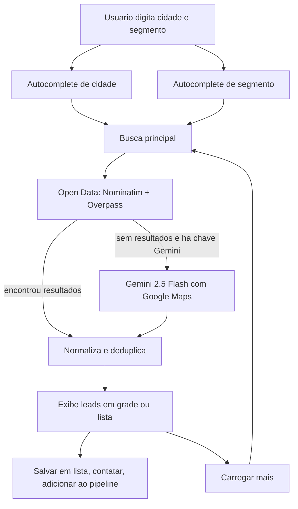

# Bloom Leads - Documentacao do App

Este documento consolida o estado atual do Bloom Leads: o que o app faz, como a navegacao funciona, quais APIs externas entram no fluxo, como a busca de leads opera e o que ainda e simulacao.

Ele foi escrito para servir como referencia central do produto, sem depender de memoria de conversa ou de arquivos espalhados.

Este guia descreve o estado atual do app. A direcao de evolucao definida pela pesquisa tecnica esta em [ROADMAP_TECNICO.md](./ROADMAP_TECNICO.md) e na pesquisa base [bloom_leads_pesquisa_tecnica_estrategica.md](./bloom_leads_pesquisa_tecnica_estrategica.md).

## Indice

- [Visao geral](#visao-geral)
- [O que o app tem hoje](#o-que-o-app-tem-hoje)
- [Stack e arquitetura](#stack-e-arquitetura)
- [Fluxo principal do usuario](#fluxo-principal-do-usuario)
- [Como a busca funciona](#como-a-busca-funciona)
- [APIs e servicos externos](#apis-e-servicos-externos)
- [Persistencia local](#persistencia-local)
- [Modulos e componentes](#modulos-e-componentes)
- [Dados e modelos](#dados-e-modelos)
- [O que e simulado](#o-que-e-simulado)
- [Pontos de atencao](#pontos-de-atencao)
- [Como rodar e validar](#como-rodar-e-validar)
- [Documentos relacionados](#documentos-relacionados)

## Visao geral

O Bloom Leads e uma ferramenta web de prospeccao B2B.
O foco atual do MVP e:

- descobrir empresas por cidade e segmento
- organizar resultados em listas
- marcar contatos como ja abordados
- mover empresas para um pipeline estilo Kanban
- registrar tarefas, atividades e pessoas dentro de um negocio
- manter tudo funcionando localmente, sem backend proprio nesta fase

O app nao e apenas uma landing page ou prototipo visual.
A jornada central de busca, organizacao e acompanhamento ja esta funcional.

## O que o app tem hoje

### 1. Login e sessao

- Login por email e senha com Firebase Auth.
- Cadastro de conta na propria tela de login.
- Sessao persistida pelo SDK do Firebase.
- Logout encerra a sessao no Firebase Auth.
- O backend antigo de auth ficou legada e nao e mais a fonte de verdade do login.
- Se o provedor Email/Senha do Firebase Auth ainda nao estiver habilitado, o app usa fallback legado para manter o MVP acessivel.
- Existe bootstrap automatico de usuario e workspace no Data Connect na primeira entrada.
- Cada usuario autenticado recebe um workspace proprio com membership e role.
- O frontend ja tem o SDK do Firebase preparado em `src/lib/firebase.ts` e espera as variaveis `VITE_FIREBASE_*` no ambiente para a autenticacao e o Firestore.

### 2. Exploracao de leads

- Busca por cidade e segmento.
- Autocomplete de cidade.
- Autocomplete de segmento com catalogo local e aliases.
- Carregamento incremental de resultados.
- Filtro local por nome da empresa ou razao social.
- Alternancia entre grade e lista.

### 3. Organizacao comercial

- Salvamento de leads em listas.
- Reabertura de listas salvas.
- Marcacao de contatos como contatados.
- Base global de contatos, alimentada a partir dos saves.
- Exportacao exibida na interface, ainda sem exportacao real de arquivo.

### 4. Pipeline / CRM

- Pipeline padrao em Kanban.
- Drag and drop entre etapas.
- Criacao de negocio a partir de um lead.
- Edicao de detalhes do negocio.
- Tarefas, atividades e pessoas associadas ao deal.

### 5. Configuracoes e interface

- Modal de configuracao de visualizacao dos cards do pipeline.
- Edicao do nome do pipeline e das etapas.
- Adicao e remocao de etapas no pipeline.
- Modal de pricing com simulacao de upgrade.
- Sistema de idioma da interface.
- Loading visual durante a busca.
- Shell de modal reutilizavel.

### 6. Dependencias de apoio

- Link direto para WhatsApp.
- Link direto para Google Maps.
- Avatar do usuario cadastrado.
- Imagem decorativa da tela de login.

## Stack e arquitetura

### Tecnologias principais

- React 19
- Vite
- TypeScript
- Tailwind CSS
- lucide-react
- `@google/genai`
- `firebase`

### Arquivos centrais

| Area | Arquivos | Papel |
| --- | --- | --- |
| Entrada do app | `src/main.tsx` | Monta o React root e injeta o `AuthProvider` |
| Orquestracao | `src/App.tsx` | Controla layout, fluxos, busca, modais e persistencia local |
| Autenticacao | `src/contexts/AuthContext.tsx` | Firebase Auth, sessao, bootstrap de usuario/workspace e logout |
| Workspaces | `src/lib/firebase.ts`, `dataconnect/example/bloom_leads.gql` | Firebase Data Connect com contexto atual da conta e membros |
| Busca por leads | `src/services/openDataService.js`, `src/services/geminiService.ts` | Fontes ativas da busca |
| Autocomplete de cidade | `src/services/locationService.ts` | IBGE, Rest Countries e cache local |
| Segmentos | `src/utils/segmentDatabase.js` | Catalogo e sugestoes de segmento |
| WhatsApp | `src/utils/whatsappLink.js` | Normalizacao do telefone e geracao do link |
| Config do card | `src/utils/cardConfigStore.js` | Estado do que aparece no card do pipeline |
| Pipeline | `src/components/PipelineBoard.tsx` | Kanban com drag and drop |
| Detalhes do negocio | `src/components/DealDetailsModal.tsx` | Edicao rica de deal |
| Settings | `src/components/SettingsModal.tsx` | Ajustes de pipeline e visualizacao |
| Login | `src/components/LoginScreen.tsx` | Fluxo de entrada real |
| Listas | `src/components/SelectListModal.tsx` | Escolha ou criacao de lista |
| Adicao ao pipeline | `src/components/AddToPipelineModal.tsx` | Selecao do pipeline para um lead |
| Loading | `src/components/LoadingBar.tsx` | Progresso visual da busca |
| Modais | `src/components/ModalShell.tsx` | Estrutura comum de dialogo |

### Documentos de contexto

- `PROJECT_CONTEXT.md` e a visao operacional do produto.
- `RESUMO_DO_PROJETO.md` e a fotografia rapida do estado do MVP.
- `DESIGN.md` e `DESIGN_SYSTEM.md` sao a base visual.
- `DECISION_LOG.md` guarda decisoes pontuais do projeto.
- `AGENTS.md` define as regras de trabalho para qualquer alteracao.

## Fluxo principal do usuario

1. O usuario entra na tela de login.
2. O login e validado no backend.
3. O app carrega cidades, listas, contatos, pipeline, deals e configuracoes do `localStorage`.
4. O usuario informa cidade e segmento.
5. O app sugere cidades e segmentos.
6. O usuario executa a busca.
7. O app mostra os resultados em grade ou lista.
8. O usuario pode salvar em lista, marcar como contatado ou criar um negocio.
9. O usuario leva o lead para o pipeline e acompanha o deal.
10. O usuario edita o negocio, adiciona tarefas, atividades e contatos.

## Como a busca funciona

### Visao geral

A busca tem duas camadas:

1. Fonte aberta local-first com OpenStreetMap / Overpass.
2. Fallback com Gemini + Google Maps quando a fonte aberta nao retornar resultados e existir chave de Gemini configurada.

### Diagrama do fluxo

### 1. Autocomplete de cidade

O fluxo de cidade vem de `src/services/locationService.ts`.

Como funciona:

- o app tenta ler `nexus_cities_cache_v5` do `localStorage`
- se nao houver cache, ele consulta duas fontes publicas
- primeiro busca paises e capitais no Rest Countries
- depois busca municipios brasileiros no IBGE
- remove duplicados
- ordena alfabeticamente
- grava o resultado em cache local

Se as duas fontes falharem, o app usa uma lista fallback com algumas cidades conhecidas.

### 2. Autocomplete de segmento

O segmento vem de `src/utils/segmentDatabase.js`.

O catalogo local:

- possui labels canonicas
- possui aliases e apelidos
- classifica segmentos por categoria

O motor de sugestoes:

- normaliza acentos e caixa alta/baixa
- prioriza match exato
- prioriza prefixo
- aceita categoria e parte interna do texto
- devolve o melhor resultado com limite configuravel

O `resolveSegmentQuery()` converte o texto digitado no segmento canonico.
Isso e importante porque a busca real so roda quando o segmento resolvido e valido.

### 3. Execucao da busca

Na tela principal, o usuario precisa:

- selecionar uma cidade da lista
- informar um segmento reconhecivel

Depois disso, `src/App.tsx` chama `fetchLeadsWithFallback()`.

Ordem de execucao:

1. Tenta `fetchOpenDataLeads()`.
2. Se vierem resultados, usa esses dados.
3. Se nao vierem resultados e nao existir chave de Gemini, para por ali.
4. Se existir chave de Gemini, chama `fetchEnrichedLeads()`.

O comportamento atual e local-first:

- a fonte aberta vem primeiro
- o Gemini entra como fallback de enriquecimento e ampliacao

### 4. Fonte aberta: Nominatim + Overpass

`src/services/openDataService.js` faz a busca nos dados abertos.

Passos:

1. Monta a consulta do Nominatim para localizar a area.
2. Usa o bounding box retornado pelo geocoder.
3. Gera a query do Overpass com filtros por segmento.
4. Consulta a API do Overpass.
5. Converte cada elemento em `Company`.
6. Remove duplicados por nome e endereco.
7. Filtra nomes ja excluidos no carregamento incremental.
8. Ordena por score heuristico.
9. Retorna no maximo a quantidade pedida.

O mapeamento tenta recuperar:

- nome fantasia
- razao social
- endereco
- cidade
- UF / regiao
- pais
- bairro
- CEP
- horario de funcionamento
- telefone
- email
- website
- redes sociais quando existirem

### 5. Fallback com Gemini + Google Maps

`src/services/geminiService.ts` usa `@google/genai`.

Detalhes:

- modelo atual: `gemini-2.5-flash`
- ferramenta ativa: `googleMaps`
- resposta esperada: array JSON estrito

A busca pede, no prompt, campos como:

- `nome_fantasia`
- `endereco`
- `telefone`
- `website`
- `atividade`
- `horario_funcionamento`
- `aberto_agora`

O retorno e limpo antes do parse:

- remove blocos de markdown
- tenta isolar o array JSON
- se nao conseguir parsear, devolve lista vazia para nao quebrar a interface

### 6. Carregar mais

Quando o usuario pede mais resultados:

- o app reaproveita cidade e segmento atuais
- envia os nomes atuais para exclusao
- tenta buscar novos leads sem repetir os ja vistos
- se nao houver novos resultados unicos, a UI avisa e encerra o fluxo incremental

### 7. Reabertura de listas

Ao abrir uma lista salva:

- o app guarda um snapshot da prospeccao atual
- substitui a visualizacao pelos dados da lista
- quando o usuario volta para `Explorar Negocios`, o snapshot e restaurado

Esse detalhe evita perder a busca anterior ao navegar entre listas e prospeccao.

## APIs e servicos externos

### APIs de negocio

| Servico | Onde aparece | Uso real | Observacoes |
| --- | --- | --- | --- |
| Gemini API | `src/services/geminiService.ts` | Enriquecimento e descoberta de leads | Usa `@google/genai` com `gemini-2.5-flash` e ferramenta `googleMaps` |
| Google Maps no Gemini | `src/services/geminiService.ts` | Busca de negocios dentro do prompt | Nao e uma chamada manual para Maps API; e a ferramenta do Gemini |
| Nominatim | `src/services/openDataService.js` | Geocodificacao e bounding box | Ponto de entrada para localizar a area de busca |
| Overpass API | `src/services/openDataService.js` | Coleta de negocios em dados abertos | Consulta elementos OSM dentro da area geograficamente resolvida |
| IBGE municipios | `src/services/locationService.ts` | Lista de municipios brasileiros | Alimenta o autocomplete de cidade |
| Rest Countries | `src/services/locationService.ts` | Paises e capitais globais | Complementa a lista de cidades com base global |

### Servicos de interface

| Servico | Onde aparece | Uso | Observacoes |
| --- | --- | --- | --- |
| WhatsApp `wa.me` | `src/utils/whatsappLink.js`, `src/components/LeadCard.tsx`, `src/components/LeadListView.tsx`, `src/components/DealDetailsModal.tsx` | Abrir conversa com o lead | Normaliza o telefone antes de montar a URL |
| Google Maps search URL | `src/components/LeadCard.tsx`, `src/components/LeadListView.tsx` | Abrir o endereco do lead no navegador | Abre pesquisa publica, sem integracao autenticada |
| `ui-avatars.com` | `server/services/authService.js` | Avatar do usuario cadastrado | Apenas para o perfil da conta |
| Unsplash | `src/components/LoginScreen.tsx` | Imagem decorativa do login | Elemento visual, nao e parte do core de negocio |
| Google favicon | `src/components/LoginScreen.tsx` | Icone do botao de login Google | Apoio visual |

### Variavel de ambiente

O build do Vite injeta `GEMINI_API_KEY` em:

- `process.env.API_KEY`
- `process.env.GEMINI_API_KEY`

Isso significa que o valor esperado no `.env.local` e `GEMINI_API_KEY`, mesmo que o codigo consuma `process.env.API_KEY` em alguns pontos.

## Persistencia local

Hoje o `localStorage` continua como apoio operacional do MVP, mas a sessao agora depende do backend.

| Chave | Conteudo |
| --- | --- |
| `bloom_auth_token` | Token de sessao do usuario autenticado |
| `nexus_saved_lists` | Listas salvas com leads e parametros da busca |
| `nexus_contacts` | Base global de contatos |
| `nexus_pipelines` | Pipelines e etapas |
| `nexus_deals` | Negocios do Kanban |
| `nexus_contacted_keys` | Chaves dos leads marcados como contatados |
| `nexus_card_visibility_config` | Configuracao de visibilidade dos cards do pipeline |
| `nexus_cities_cache_v5` | Cache da lista de cidades |

### Observacoes da persistencia

- A sessao depende de backend; listas, contatos, pipeline e filtros continuam locais nesta fase.
- O workspace atual e carregado junto da sessao e pode ser consultado no backend.
- Ao salvar uma lista, os leads tambem entram na base de contatos, se ainda nao existirem.
- O status de contatado usa uma chave derivada de nome + endereco + cidade + UF, nao do id aleatorio do lead.
- O app tenta migrar chaves antigas baseadas em nome + cidade quando consegue associar a filial sem ambiguidade.
- A configuracao dos cards do pipeline e restaurada do `localStorage`.
- O snapshot de prospeccao usado ao voltar de uma lista e apenas em memoria, nao persistido entre recargas.

## Modulos e componentes

### Navegacao principal

O menu lateral exposto hoje contem:

- `Explorar Negocios`
- `Minhas Listas`
- `Pipeline (Kanban)`
- `Contatos`

### Componentes de tela

- `LoginScreen` mostra a entrada real por email/senha.
- `LeadCard` mostra o lead em modo grade.
- `LeadListView` mostra o lead em modo tabela.
- `LoadingBar` mostra o progresso visual da busca.
- `PipelineBoard` organiza os deals por etapa com drag and drop.
- `DealDetailsModal` concentra edicao rica do negocio.
- `SelectListModal` permite salvar em lista existente ou criar nova.
- `AddToPipelineModal` escolhe o pipeline ao criar um deal.
- `PricingModal` simula upgrade.
- `SettingsModal` ajusta visual e etapas do pipeline.
- `ModalShell` padroniza overlay, foco e Escape.

### Componentes e docs de referencia

Os textos de arquitetura desse conjunto devem ser lidos como visao de evolucao, nao como integracao ativa do runtime.

## Dados e modelos

### Modelos principais

- `Company`
- `SavedList`
- `Pipeline`
- `PipelineStage`
- `Deal`
- `DealTask`
- `ActivityLog`
- `LeadPerson`
- `User`

### Fontes de dado ativas

Hoje o app gera empresas principalmente a partir de:

- `GOOGLE_MAPS` no fallback de Gemini
- `OPEN_DATA` na camada aberta com Nominatim + Overpass

Outros valores do tipo `DataSource`, como `GOV_DATA`, `WEB_SCRAP` e `LINKEDIN`, existem como reserva para extensao futura.

### Regras visiveis do modelo

- `Company.score` e heuristico.
- `Company.status` existe, mas o fluxo atual foca mais em `NEW` e `CONTACTED`.
- `Deal` carrega `contactInfo`, `customFields`, `activities`, `people` e `tasks`.
- `CardVisibilityConfig` controla o que aparece no card do Kanban.

## O que e simulado

Algumas partes sao reais no fluxo local, mas ainda nao representam backend de producao.

### Simulados hoje

- upgrade de plano
- processamento de pagamento
- limite mensal de uso como regra de produto real
- exportacao de arquivo
- criacao rapida de negocio a partir do quadro quando o atalho aponta de volta para a exploracao
- revelacao de email dentro do `DealDetailsModal`

### Reais hoje

- login por email e senha
- workspace atual com membros e role
- busca de cidades
- busca de leads
- links de WhatsApp e Google Maps
- listas salvas
- contatos
- pipeline
- edicao de deals
- configuracoes do card do pipeline

## Pontos de atencao

- O app ja tem backend proprio para busca, mas a autenticacao agora e feita por Firebase.
- O Google login nao esta conectado nesta fase.
- O workspace atual ja e resolvido pelo Data Connect, mas a UI ainda nao exibe todos os detalhes de membros.
- O Firebase ja esta configurado como base de infraestrutura no frontend e a sessao ja esta em Firebase Auth.
- Nao existe persistencia em banco de dados.
- A tela de pricing e uma simulacao.
- O export ainda nao gera arquivo.
- Alguns textos e doc de arquitetura usam linguagem de visao futura; isso nao significa que o runtime ja tenha essa integracao.
- A busca aberta depende da disponibilidade das APIs publicas.
- A busca Gemini depende da chave configurada no ambiente.

## Como rodar e validar

### Rodar localmente

1. Instalar dependencias.
2. Criar ou ajustar o arquivo `.env.local`.
3. Definir `GEMINI_API_KEY`.
4. Rodar o app com `npm run dev`.

### Validacao minima recomendada

1. Rodar `npm run build`.
2. Rodar `node tests/run.mjs`.
3. Abrir o app e testar:
- login real via backend
   - busca de cidade e segmento
   - salvar lead em lista
   - marcar lead como contatado
   - enviar lead ao pipeline
   - abrir detalhes do negocio
   - ajustar configuracao do card no Settings

### O que a validacao cobre

- o bundle continua compilando
- os checks de integracao internos seguem coerentes
- o fluxo principal nao foi quebrado
- a documentacao nao introduziu dependencia nova

## Documentos relacionados

- `README.md` e o ponto de entrada simples para setup.
- `PROJECT_CONTEXT.md` descreve o contexto atual do produto.
- `RESUMO_DO_PROJETO.md` resume o estado do MVP.
- `ROADMAP_TECNICO.md` consolida a evolucao planejada em fases.
- `bloom_leads_pesquisa_tecnica_estrategica.md` e a base analitica da mudanca de direcao.
- `DESIGN.md` detalha a proposta visual.
- `DESIGN_SYSTEM.md` organiza tokens e componentes visuais.
- `DECISION_LOG.md` registra decisoes importantes.
- `AGENTS.md` define as regras operacionais para alteracoes.

